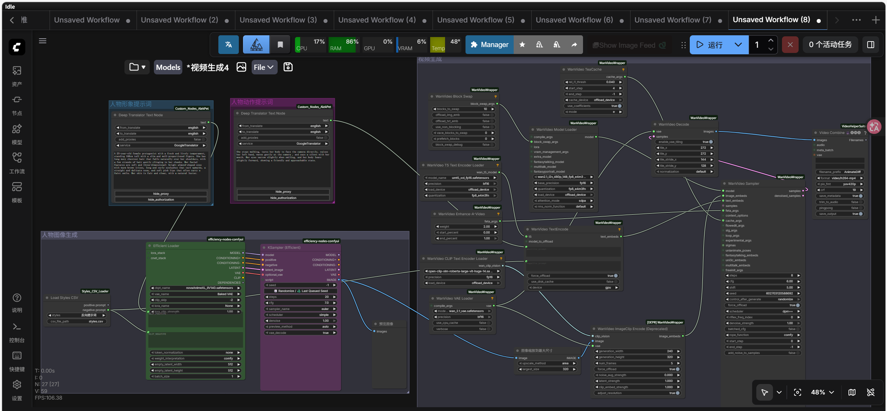
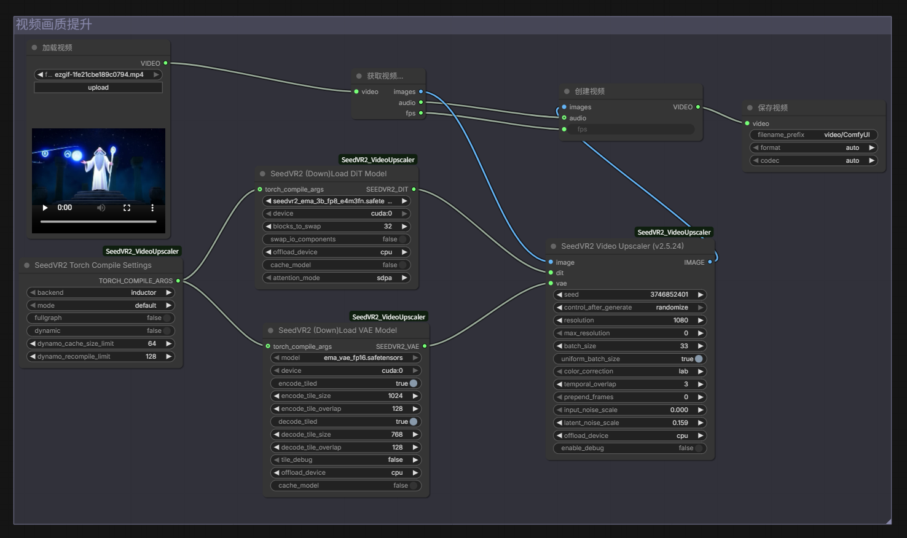

# 语言驱动的视频生成方法
大创项目“语言驱动的视频生成方法”。利用文生图模型指导wan2.1视频生成模型进行视频生成，从而实现各种风格的更高质量视频的生成。

在本仓库中，我们制作了几个ComfyUI工作流。这些工作流提供了将文生图模型与图生视频结合，从而生成质量更高的各种人物风格视频的功能。此外，我们尽量减少了运行时占用的内存与GPU，使该工作流可以在个人计算机上运行。

## 工作流使用示例
### 1.模型下载
我们选择了wan2.1作为我们的图生视频模型。该模型占用显存较小，可以在消费级显卡上运行。同时该模型视频生成质量较好，并提供了多种可选择的分辨率。

[**Wan2.1**](https://github.com/Wan-Video/Wan2.1)

请根据需要下载以下模型或模型的其他版本

**Diffusion models**

- [**wan2.1_i2v_720p_14B_fp8_e4m3fn.safetensors**](https://huggingface.co/Comfy-Org/Wan_2.1_ComfyUI_repackaged/resolve/main/split_files/diffusion_models/wan2.1_i2v_720p_14B_fp8_e4m3fn.safetensors?download=true)

- [**wan2.1_i2v_480p_14B_fp8_e4m3fn.safetensors**](https://huggingface.co/Comfy-Org/Wan_2.1_ComfyUI_repackaged/resolve/main/split_files/diffusion_models/wan2.1_i2v_480p_14B_fp8_e4m3fn.safetensors?download=true)

**Text encoders**

- [**umt5_xxl_fp8_e4m3fn_scaled.safetensors**](https://huggingface.co/Comfy-Org/Wan_2.1_ComfyUI_repackaged/resolve/main/split_files/text_encoders/umt5_xxl_fp8_e4m3fn_scaled.safetensors?download=true)

**VAE**

- [**wan_2.1_vae.safetensors**](https://huggingface.co/Comfy-Org/Wan_2.1_ComfyUI_repackaged/resolve/main/split_files/vae/wan_2.1_vae.safetensors?download=true)

**CLIP Vision**

- [**clip_vision_h.safetensors**](https://huggingface.co/Comfy-Org/Wan_2.1_ComfyUI_repackaged/resolve/main/split_files/clip_vision/clip_vision_h.safetensors?download=true)

 

你可以选择任何你喜欢的文生图模型。在默认的工作流中，我们使用了**Nova Anime XL**作为我们的文生图模型，以获得更好的动漫人物形象生成效果。

- [**novaAnimeXL_ilV140.safetensors**](https://civitai.com/api/download/models/2741698?type=Model&format=SafeTensor&size=pruned&fp=fp16)

### 2.完成参数与模型设置

- 将你想要的人物形象描述文本和人物动作描述文本分别输入到两个Text Node中
- 确保每个节点加载了正确的模型
- 通过修改`WanVideo Sample`节点中的`steps`参数来调整视频长度
- 点击`RUN(运行)`来生成视频

### 3.视频分辨率提升(视频缩放）

我们在工作流中添加了SeedVR2的视频缩放功能，如果你需要提升生成后视频的分辨率，请启用并运行SeedVR2的工作流。

请参照下图完成参数设置。

- 通过修改`SeedVR2 Video Upscaler`节点中的`resolution`参数来调整视频分辨率

 

## 💡关于本项目

**❓为什么我们要结合文生图模型与视频生成模型**
- 一般的视频生成模型在生成场景时有概率出现人物细节丧失的问题。本项目通过让文生图模型指导视频生成模型进行创作，同时将人物的形象信息与动作信息分离，能生成人物信息更加丰富的AI视频。
- 通过选择不同的文生图模型，可以在不改变视频生成模型的情况下令生成的人物和场景实现不同的风格，也可以通过Lora模型实现特定人物形象的生成。
- 图生视频模型比文生视频模型所需要的采样次数更少，这加快了视频生成的速度。

**❓我们如何减少内存与GPU占用**
- 我们将文生图的过程与视频生成过程分离，在每个过程中仅加载对应模型。
- 我们使用了Transformer块交换策略，只将当前计算需要的Block留在GPU显存，暂时不用的Block交换到CPU内存/硬盘，需要时再换回来，以此降低显存占用。

 

## 📑其他问题
